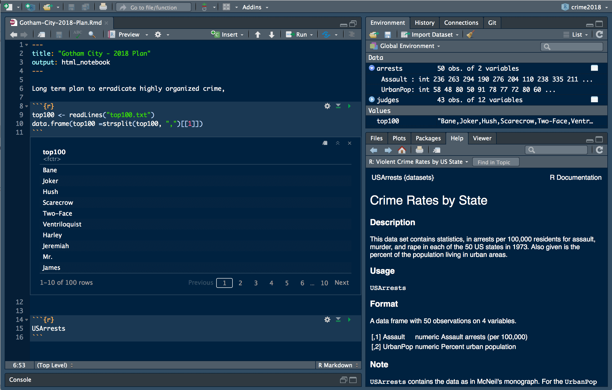

## Who am I?

* Started at KPMG in 2012
* Early career as a data analyst
* Self study, then MSc Data Science
* Transferred to data scientist post-MSc
* 5 years using and teaching R

## Materials

Available
[online](https://hdp-service.uk.kworld.kpmg.com/stash/projects/JL/repos/r-training/browse).

## Checkpoint

To help me get an understanding of your level who has:

1. Programmed in R before?
2. Programmed in _any_ language before?
3. Seen R code before?
4. Used Excel/other point-and-click tools for data analysis?

# R and the `tidyverse`

## R

> An _environment_ and a _language_ for data analysis and programming

* Free
* Flexible
* Powerful

<aside class="notes">
* Reads data in to RAM - faster than on disk
* Can flexibly talk to data in databases - convenient
* Can read most/all data
* Built in/packaged functionality for pretty much any type of data analysis/science
* Not fast. Not slow. Optimised for working with data.
</aside>

## R Growth

```{r growth, echo = FALSE}

```

<aside class="notes">
* One of the fastest growing languages (along with Python, Rust, and Go)
* Popular tag on SO
* Not a popularity contest, but more people = more stuff developed
</aside>

## Rstudio

A powerful [IDE](http://www.rstudio.com/) for R. 

```{r rstudio, echo = FALSE}

```

<aside class="notes">
* Fantastic company with lots of excellent products/tools developed and freely released
* 4 panes (layout configurable):
    * Console - interactive R terminal
    * Source editor - write scripts/create notebooks
    * Environment/history/connections - see R objects, see DB/spark connections, get history of commands
    * Files/plots/packages/help - File browser, plot outputs, documentation
* Projects - create one
    * Associated a bunch of code/data with a directory for ease of use
* Help > Cheatsheets    
</aside>

## The `tidyverse`

* A [collection](https://www.tidyverse.org/) of R _packages_ with a common approach.

* __Package__: Extra functionality that can be added to R, developed by R users.

* Installed and then loaded with:

```{r eval = F}
install.packages("[some_package]")
library(some_package)
```

I.e. for the tidyverse:

```{r eval = F}
install.packages("tidyverse") # Install the package
library(tidyverse) # Load the package
```

<aside class="notes">
* Note - uses the internet
* Other options for installing in internet-less environment (ask me after)
* Open Rstudio
* Type the install commands in to the console - problems?
* May fail on restricted systems (e.g. w/o admin rights)
* May ask to put packages in local folder
</aside>

## The `tidyverse`

```{r}
library(tidyverse)
tidyverse_logo()
```

<aside class="notes">
* Can you run `library()`
* And `tidyverse_logo()`?
* All good?
</aside>

## Functions

* Operations performed by R e.g. `library()`, or `mean()`

<br>

* Have _arguments_ - how they are used.

<br>

* Get help using `?function_name` in the console, e.g. `?library`, `?mean`
* Or in RStudio highlight function and press F1

<aside class="notes">
* Arguments are _named_, or R just assumes by position
* We can define our own functions (not in today's session, but good to know)
</aside>


## Assignment in R

Assignment: saving output to a value

```{r assign}
x <- seq(0, 10) # or x <- 1:10
the_average <- mean(x)
```

If you don't assign, R just prints the output.

```{r}
x
the_average
```

<aside class="notes">
* Can also use `=`, but `<-` is preferred style (and `=` used inside function calls)
* Assign the name x the value 4
* Can save anything to a variable, individual values, lists, data.frames (tables), statistical models
* Can you do this in the console?
</aside>

## Viewing saved objects

We can look at an object by printing it.

Or use functions to inspect it:

```{r}
str(mtcars) # str displays the structure of an R object!
```

<aside class="notes">
* The RStudio Environment is also very helpful to see the objects we have saved
* Remove objects with `rm()` (or just overwrite them)
* Can you do this in the console?
</aside>

## Getting help

* `?function` - R documentation
* [`tidyverse`](tidyverse.org) website
* [R for Data Science](http://r4ds.had.co.nz/)
* Rstudio [community](https://community.rstudio.com/)
* `#rstats` on [twitter](https://twitter.com/search?q=%23rstats)
* [Stack Overflow](https://stackoverflow.com/questions/tagged/r) 
* [Jim](mailto:jim.leach@kpmg.co.uk)

## Next

[Data visualisation with `ggplot2`](./01-plotting-with-ggplot2.html)


