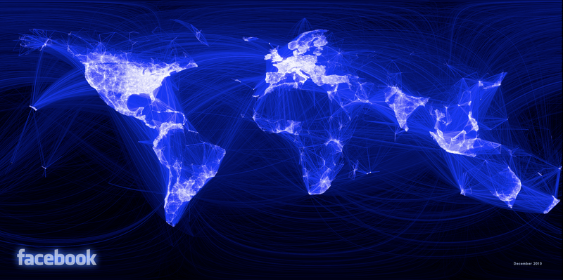

```{r setup, include=FALSE}
knitr::opts_chunk$set(echo = FALSE)
library(ggplot2)
```

## In this section

* A grammar of graphics
* ggplot2

# A grammar of graphics

## A grammar of graphics? {.centered}

<blockquote><p align="left">'A grammar of graphics is a tool that enables us to concisely describe the components of a graphic. Such a grammar allows us to move beyond named graphics (e.g., the “scatterplot”) and gain insight into the deep structure that underlies graphics.'</p>
<footer><cite><a href="http://byrneslab.net/classes/biol607/readings/wickham_layered-grammar.pdf">&mdash; Wickham (H), 2008, "A Layered Grammar of Graphics"</a></cite>
</footer>
</blockquote>

<aside class="notes">
* What is our visualisation?
* How can we describe it to others?
* How can we create more complex graphics?
* Will not mean perfect visualisations: good grammar just the first step of a good sentence.
* __NOT__ talking about: effective visualisation, communication etc
</aside>

## Basic elements

There are three basic elements of a plot:


<aside class="notes">
1. Data: used to make the plot. Typically rows and columns (but not always)
2. Geoms: the visual, geometric objects that are used to represent the data
3. Coordinate system: onto which we place the geoms
    * Typically Cartesian for us (XY plane) but could be something more complex
</aside>

## Displaying data

Map variables in the data to the visual properties of the geom: the __aesthetics__.


<aside class="notes">
* Basic plot: elements of the data, and _map_ them to aesthetics.
* This _translates_ data into visual marks
* This may sound obvious, but important to understand the basic principles at work
    * Understanding what data can be mapped to what aesthetics is crucial
</aside>

# ggplot2

## ggplot2 {.centered}

<blockquote>
<p align="left">'The emphasis in ggplot2 is reducing the amount of thinking time by making it easier to go from the plot in your brain to the plot on the page.'</p>
<footer><cite><a href="https://www.youtube.com/watch?v=RHu5vgBZ1yQ">&mdash; Wickham (H), 2012, "A Backstage Tour of ggplot2"</a></cite>
</footer>
</blockquote>

## What is `ggplot2`

```{r lib-ggplot2, echo = T, eval = T}
library(ggplot2) # Or library(tidyverse) for the other packages, too
```

* Hugely popular `R` package 

<br>

* Implements the grammar of graphics

<br>

* Declarative DSL for visualisation

<aside class="notes">
* Popular - usually in the top 3 ranked on downloads per day.
* Impressive given there are now over 10k packages on CRAN
* Code is how to load the package in R
</aside>

## Diamonds

```{r diamonds, eval = F}
?diamonds
```

```{r diamonds-show}
knitr::kable(head(diamonds))
```

<aside class="notes">
* Built in data set that comes with `ggplot2`
* Contains the prices and other attributes of almost 54,000 diamonds. 
* Diamond characteristics and prices
* Type `?diamonds` at the console to get more details
</aside>

## A ggplot

What is the relationship between carat and price for diamonds of different clarities?

```{r ggplot2-eg, echo = FALSE, fig.height=4, fig.width=10, message = FALSE, cache = TRUE}
ggplot(diamonds, aes(carat, price, colour = clarity)) +
  geom_point(alpha = .015) + 
  geom_smooth() +
  scale_y_continuous(labels = scales::comma) +
  labs(x = "Carat",
       y = "Price ($)",
       title = "The relationship between price and carat",
       subtitle = "For diamonds of different clarities",
       caption = "Source: ggplot2 diamonds data") +
  theme_light()
```

<aside class="notes">
* Specify data & mappings: x (carat), y (price), colour (clarity)
* Add elements to control: geoms (point and smooths) , facet (by clarity), scales (colour and y), visuals (labels, themes)
* _Set_ some parameters: alpha of the points to avoid over-plotting and see the smooth fit better
</aside>

## Starting out - ggplot()

* `ggplot()` sets the plot up
* `aes()` controls how variables are _mapped_ to aesthetics

```{r base-ggplot, echo = T, eval = F}
# ggplot(data, aes(x = [field1], y = [field2], ...))
ggplot(diamonds, aes(x = carat, y = price, colour = clarity))
```

* Enter `?ggplot` or `?aes` in the console to pull up the help.

* Used to specify _data_ and _mappings_.

<aside class="notes">
* Open a _Script_ (File > New > Script, or CTRL+SHIFT+N)
* _Scripts_ are just text files with `.R` extension that let us save our commands easily
* Make the plot yourself!
* What this makes
* Sensible defaults for gridlines, labels etc
</aside>

## Starting out - ggplot()

```{r base-ggplot-show, echo = T, eval = T, fig.height=4, fig.width=10, message = FALSE}
ggplot(diamonds, aes(x = carat, y = price, colour = clarity))
```

<aside class="notes">
* Already sets up the plotting area for us - based on the data and mappings we've given it
* We get plot area, axis scales, labels etc "for free"
* Additional _layers_ are required for displaying the data
* Additional layers will use the aesthetic mappings in the `ggplot()` call
</aside>

## Adding layers

```{r base-plus-points, echo = T, fig.align='center', fig.width=10, fig.height=4, message = FALSE}
ggplot(diamonds, aes(carat, price, colour = clarity)) +
  geom_point(alpha = .015)
```

<div class="notes">
* Make the plot yourself!
* Drop `x` and `y`, they are always the first two arguments of `aes` so we can save some typing
    * Everything else needs to be named
* We add _layers_ to the plot using `+`; Layer = `geom_*`
* Have already specified data + mapping, geom is how to _display_ the data
* We can also _set_ attributes (e.g. alpha), rather than mapping them to data
* Also get the legend "for free" (distinct from some plotting systems)
</div>


## Adding different layers

```{r base-plus-smooth, echo = T, fig.align='center', fig.width=10, fig.height=4, message = FALSE, warning = FALSE, cache = TRUE}
ggplot(diamonds, aes(carat, price, colour = clarity)) +
  geom_smooth()
```

<div class="notes">
* Make the plot yourself!
* We can add a different layer to see a different plot
* Have already specified: data, mapping, (coordinate system)
* Here we just add a different geom - a smoother
* The smoother is a _statistical transformation_ that summarises the data
* The smoother shows a different angle of the same data
</div>


## Adding multiple layers

```{r base-plus-smooth-points, echo = T, fig.align='center', fig.width=10, fig.height=4, message = F, warning = F, cache=T}
ggplot(diamonds, aes(carat, price, colour = clarity)) +
  geom_point(alpha = .015) + geom_smooth() 
```

<div class="notes">
* Make the plot yourself!
* Same chart, but multiple views of the same data in one place with multiple geoms
* Now diamond price vs. carat, colour by clarity, with points _and_ smoother
* Remember the grammar: data, geom, mappings
* However - kind of hard to see, so can we break it down? Filter data? Multiple plots?
</div>


## Scales to control mappings

```{r base-facets-scales, echo = T, fig.align='center', fig.width=10, fig.height=4, message = FALSE, cache = TRUE}
ggplot(diamonds, aes(carat, price, colour = clarity)) +
  geom_point(alpha = .015) + geom_smooth() +
  scale_y_continuous(labels = scales::comma)
```

<div class="notes">
* Make the plot yourself!
* Let's specify _how_ to display the y values, use the `comma` function from the `scales` package 
    * Specify that `y::x` is use `x` from `y`
    * Try without `scales::` - may get an error (R doesn't know where to look)
* Let's finish up with some tidy axis labels, and change the theme of the plot
</div>

## Finished plot

```{r ggplot_show, eval = FALSE, echo = TRUE, fig.height=4, fig.width=10, message = FALSE}
ggplot(diamonds, aes(carat, price, colour = clarity)) +
  geom_point(alpha = .015) + 
  geom_smooth() +
  scale_y_continuous(labels = scales::comma) +
  labs(x = "Carat",
       y = "Price ($)",
       title = "The relationship between price and carat",
       subtitle = "For diamonds of different clarities",
       caption = "Source: ggplot2 diamonds data") +
  theme_light()
```

* Add labels with `labs()`
* Specify a predefined _theme_ (or create a custom one with `theme()`)
* Lay out code 1 layer per line

<div class="notes">
* Full `ggplot()` syntax seems verbose at first glance, but follows structure of grammar and can be built step-by-step
* Specify data & mappings
* Make the plot yourself!
* Many different `geom_` functions - see Cheatsheet!
* Often don't even need to prepare data before, we can use ggplot to do it as it plots
</div>

## Finished plot

```{r ggplot_eval, eval = T, echo = F, fig.height=5, fig.width=10, message = FALSE, cache = TRUE}
ggplot(diamonds, aes(carat, price, colour = clarity)) +
  geom_point(alpha = .015) + 
  geom_smooth() +
  scale_y_continuous(labels = scales::comma) +
  labs(x = "Carat",
       y = "Price ($)",
       title = "The relationship between price and carat",
       subtitle = "For diamonds of different clarities",
       caption = "Source: ggplot2 diamonds data") +
  theme_light()
```

## Finished plot with KPMG themes

```{r ggplot_kpmg, eval = F, echo = T, fig.height=5, fig.width=10, message = FALSE}
library(ggkpmg)

ggplot(diamonds, aes(carat, price, colour = clarity)) +
  geom_point(alpha = .015) + 
  geom_smooth(se = FALSE) +
  scale_y_continuous(labels = scales::comma) +
  scale_colour_manual(values = unname(kpmgcolours("graphs"))) +
  labs(x = "Carat",
       y = "Price ($)",
       title = "The relationship between price and carat",
       subtitle = "For diamonds of different clarities",
       caption = "Source: ggplot2 diamonds data") +
  theme_kpmg()
```

## Finished plot with KPMG themes

```{r ggplot_show_kpmg, eval = T, echo = F, fig.height=5, fig.width=10, message = FALSE, cache = TRUE}
library(ggkpmg)

ggplot(diamonds, aes(carat, price, colour = clarity)) +
  geom_point(alpha = .015) + 
  geom_smooth(se = FALSE) +
  scale_y_continuous(labels = scales::comma) +
  scale_colour_manual(values = unname(kpmgcolours("graphs"))) +
  labs(x = "Carat",
       y = "Price ($)",
       title = "The relationship between price and carat",
       subtitle = "For diamonds of different clarities",
       caption = "Source: ggplot2 diamonds data") +
  theme_kpmg()
```

## Some examples


[Source](https://github.com/tidyverse/ggplot2/wiki/Crime-in-Downtown-Houston,-Texas-:-Combining-ggplot2-and-Google-Maps)

## Some examples


## Some examples


[Source](http://spatial.ly/2012/02/great-maps-ggplot2/)

## Some examples



[Source](https://www.facebook.com/notes/facebook-engineering/visualizing-friendships/469716398919)

## Further reading

* R for Data Science, Chapter 3 - Data Visualisation. [Link](http://r4ds.had.co.nz/data-visualisation.html)
* R for Data Science, Chapter 28 - Graphics for Communication. [Link](http://r4ds.had.co.nz/graphics-for-communication.html)
* Data Visualisation with ggplot2 online course. [Link](https://www.datacamp.com/courses/data-visualization-with-ggplot2-1)
* R Graphics Cookbook. [Link](https://www.amazon.com/dp/1449316956/ref=as_li_ss_tl?&linkCode=sl1&tag=ggplot2-20&linkId=4daa45d4fbd0a187163a6ff9d56d986e)
* ggplot2: Elegant graphics for data analysis 2nd ed. (Wickham, 2016). [Link](https://www.amazon.com/ggplot2-Elegant-Graphics-Data-Analysis/dp/331924275X/ref=as_li_ss_tl?ie=UTF8&linkCode=sl1&tag=ggplot2-20&linkId=4b4de5146fdafd09b8035e8aa656f300)

## Next

[Working with data](./02-working-with-data.html)