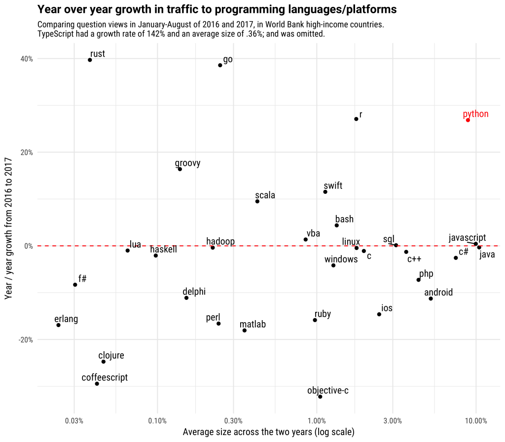

## Who am I?

* Started with KPMG in 2012
* Analyst in Data Insight Services
* Data scientist in TechSolutions/Lighthouse
* 5 years using and teaching R

## Materials

Available
[online](https://hdp-service.uk.kworld.kpmg.com/stash/projects/JL/repos/r-training/browse).

## Agenda

* Introduction to R
* Plotting with `ggplot2`
* Manipulating data with R
* Getting data in to R
* Creating reports with R

## Checkpoint

To help me get an understanding of your level who has:

1. Programmed in R before?
2. Programmed in _any_ language before?
3. Seen R code before?
4. Used Excel/other point-and-click tools for data analysis?

# R and the `tidyverse`

## R

> An _environment_ and a _language_ for data analysis and programming

* Free
* Flexible
* Powerful

## R Growth

```{r growth, echo = FALSE}

```

## Rstudio

A powerful [IDE](http://www.rstudio.com/) for R. 

```{r rstudio, echo = FALSE}
knitr::include_graphics("./www/rstudio.png")
```

## The `tidyverse`

A [collection](https://www.tidyverse.org/) of R _packages_ for working with data in a common way.

### Package installation

Extra functionality that can be added to R

```{r eval = F}
install.packages("tidyverse") # Install the package
library(tidyverse) # Load the tidyverse
```

## The `tidyverse`

* `ggplot2` - making graphs
* `dplyr` - manipulating data
* `readr`/`readxl` - getting data in to R
* Others

## Getting help

* Rstudio [community](https://community.rstudio.com/)
* `#rstats` on [twitter](https://twitter.com/search?q=%23rstats)
* [Stack Overflow](https://stackoverflow.com/questions/tagged/r) 
* [Jim](mailto:jim.leach@kpmg.co.uk)


